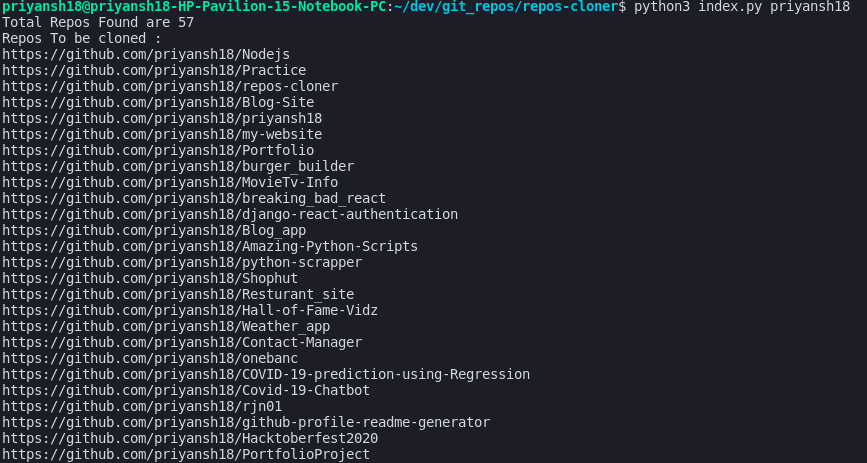

## 🏆 repos-cloner

Python script to clone all the public github repositories with just a single command 😉.

## Why you may want to do this 🤔 ? 

I was switching from windows to ubuntu and realized that I have to clone all my work from Github, instead of all the headache to get all the repo links and write git clone <repo_link> manually, I thought of writing a python script which automatically clones all the public repos after fetching all the links with just a single command.

## 🐾 Steps to clone all the `public` repos from Github

#### 1. Install Python3

#### 2. Star and clone this repo via

```cmd
git clone https://github.com/priyansh18/repos-cloner
```

#### 3. Run this command

```cmd
python3 index.py <username>
```
`Note: where username is a placeholder for your github username`

#### congrats!👏, wait for the command line to finish its work, you enjoy seeing the folder inside which repos are cloning.



**🤕Beware: This will clone all the github repos `inside the same folder/directory` as this repo location so choose cloned repo location wisely!**
